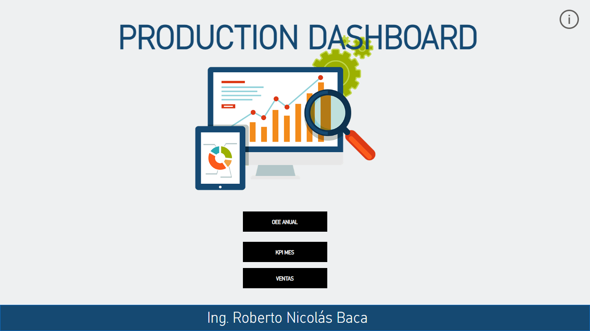
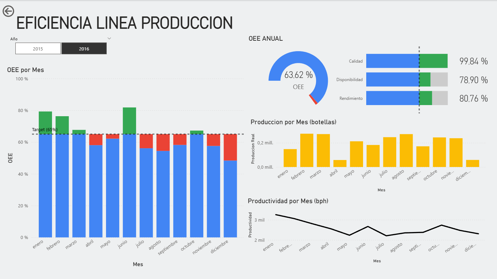
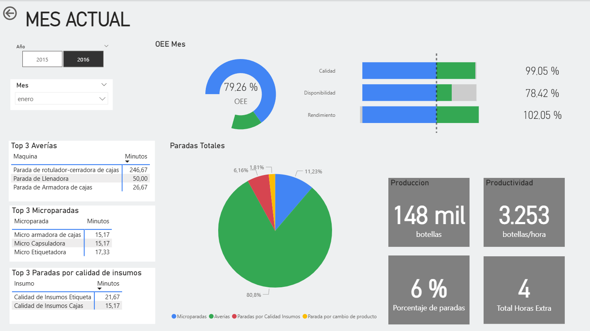
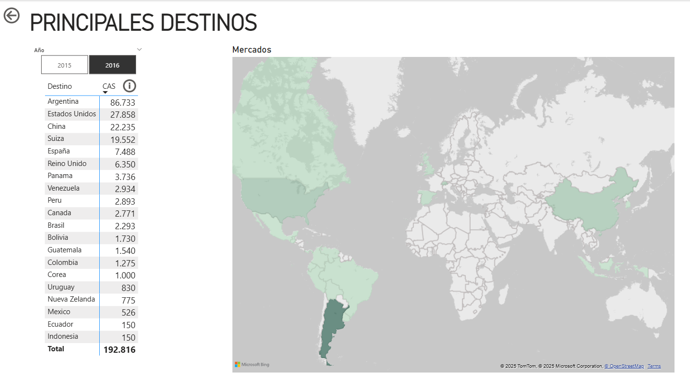

# 🏭 Production Dashboard – Power BI

This repository showcases an interactive Production Dashboard built with **Power BI**.  
It provides key insights into manufacturing performance, efficiency, and output over time, enabling data-driven decisions in a production environment.

## 📊 Dashboard Features

- 📅 Production performance over time  
- ⚙️ Bottling line efficiency
- 📦 Units produced
- ⏱️ Downtime and loss analysis
- 📌 Key KPIs like OEE (Overall Equipment Effectiveness
- 📈 Interactive filters for date

## 📷 Screenshots

Below are examples of the dashboard visuals:

### Overview Page

### Line Efficiency

### Downtime Analysis

### Main Markets

## 🛠 Technical Highlights

- **Power BI Desktop** for building visuals and interactions
- **Power Query** for robust data transformation and cleaning
- **Excel** as main data source
- **DAX** for custom calculations and KPIs
- **Data Modeling** to connect multiple sources efficiently

## 🚀 Getting Started

1. Clone this repo
2. Open the `.pbix` file in Power BI Desktop
3. Connect your own data or explore the current visuals

## 📌 Notes

- This project is for demo and portfolio purposes
- All data is either sample or anonymized

## 📬 Contact

If you have questions or feedback, feel free to reach out!  
Created by **[Roberto Nicolás Baca]**

